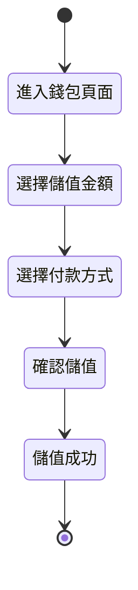

# 撰寫產品需求文件 (PRD)

## 概述

這個 skill 幫助您撰寫結構完整、資訊豐富的產品需求文件（Product Requirements Document, PRD）。透過標準化的章節結構與撰寫指引，確保文件涵蓋所有關鍵資訊，讓開發團隊、設計師與利害關係人都能清楚理解需求。

本 skill 特別強調**商業導向**與**情境化**的撰寫方式，避免過早陷入技術細節。

## 適用情境

- 🎯 **新功能開發**：需要為即將開發的新功能撰寫完整需求文件
  
- 🎯 **需求標準化**：團隊需要統一 PRD 的撰寫格式與品質
  
- 🎯 **跨團隊溝通**：需要讓不同背景的成員（PM、設計、工程、業務）都能理解需求

## 使用方式

### 前置準備

使用此 skill 前，您需要：
- 明確的功能目標與商業價值
- 基本的用戶研究或需求背景
- 了解目標用戶與使用情境

### 使用步驟

#### 步驟 1：建立文件骨架

使用以下標準結構建立 PRD 文件：

```markdown
# [功能名稱]

[1-2 句簡要說明]

## 目錄
- [1. 概述 / 範疇](#1-概述--範疇)
- [2. 商業目標與成功指標](#2-商業目標與成功指標)
- [3. 用戶情境與旅程](#3-用戶情境與旅程)
- [4. 功能規格](#4-功能規格)
- [5. 驗收標準](#5-驗收標準)
- [6. 非功能性需求](#6-非功能性需求)
```

#### 步驟 2：撰寫概述與範疇

在第一章清楚說明：
- 這個功能要解決什麼問題
- 目標用戶是誰
- 範疇內與範疇外的事項

#### 步驟 3：定義商業目標

說明：
- 為什麼要做這個功能（商業價值）
- 如何衡量成功（KPI / 成功指標）
- 預期的影響範圍

#### 步驟 4：描繪用戶情境

使用流程圖或使用者旅程圖，展示：
- 用戶如何使用這個功能
- 關鍵的互動點
- 可能的例外情境

#### 步驟 5：撰寫功能規格

依照「架構優先、細節在後」的原則：
1. 先用流程圖展示整體架構
2. 再逐步說明各個步驟的細節
3. 使用表格整理規則與狀態

#### 步驟 6：定義驗收標準

列出可測試的驗收條件：
- 功能完整性
- 商業規則正確性
- 用戶體驗流暢度

### 關鍵原則

| 原則 | 說明 | 範例 |
|------|------|------|
| 商業語言優先 | 避免技術術語，使用商業邏輯描述 | ✅ "用戶完成 KYC 後" vs ❌ "kyc_status = 'completed'" |
| 架構優先 | 先整體後細節 | 先展示流程圖，再說明每個步驟 |
| 情境化標題 | 具體反映內容 | ✅ "會員中心頁面佈局" vs ❌ "UI 規格" |
| 視覺化輔助 | 善用圖表 | 使用 Mermaid 流程圖、狀態圖 |

## 範例

### 範例 1：會員錢包功能 PRD

**情境說明**：
需要為金融科技平台撰寫「會員錢包」功能的 PRD，讓用戶可以儲值、提領與查看餘額。

**實際操作**：

1. 建立文件骨架（使用標準結構）
2. 在「概述」中說明錢包功能的商業價值
3. 繪製用戶儲值與提領的流程圖
4. 使用狀態圖展示錢包帳戶的各種狀態
5. 用表格整理儲值/提領的規則與限制
6. 定義驗收標準（如：額度檢查、KYC 驗證）

**文件結構範本**：

```markdown
# 會員錢包功能

為用戶提供便捷的儲值與提領服務，提升平台資金流轉效率。

## 1. 概述 / 範疇

### 1.1 功能目標
讓已完成 KYC 的會員可以...

### 1.2 目標用戶
- 主要：已完成 KYC 的一般會員
- 次要：...

### 1.3 範疇界定
- ✅ 範疇內：儲值、提領、餘額查詢
- ❌ 範疇外：跨境匯款、投資理財

## 2. 商業目標與成功指標

### 2.1 商業價值
- 提升用戶留存率...
- 增加平台交易量...

### 2.2 成功指標
- 月活躍錢包用戶數 > 10,000
- 儲值成功率 > 95%

## 3. 用戶情境與旅程

### 3.1 儲值流程


## 4. 功能規格

### 4.1 錢包狀態定義
| 狀態 | 條件 | 可執行操作 |
|------|------|-----------|
| 正常 | 已完成 KYC | 儲值、提領 |
| 受限 | 未完成 KYC | 僅可查看 |
| 凍結 | 違規行為 | 無法操作 |

...（詳細規格）

## 5. 驗收標準
- [ ] 已完成 KYC 的用戶可以成功儲值
- [ ] 儲值金額正確反映在餘額中
- [ ] 提領金額不可超過可用餘額
...
```

**預期結果**：
產出一份結構完整、邏輯清晰的 PRD，讓工程師可以直接依此開發，設計師可以理解互動邏輯。

---

### 範例 2：簡化版 PRD（小功能）

**情境說明**：
為「密碼變更」這類小功能撰寫簡化版 PRD。

**文件結構**：

```markdown
# 密碼變更功能

## 概述
讓用戶可以自行變更登入密碼，提升帳戶安全性。

## 功能流程
1. 用戶進入「設定」頁面
2. 點擊「變更密碼」
3. 輸入目前密碼
4. 輸入新密碼（兩次確認）
5. 系統驗證後更新密碼

## 驗證規則
- 新密碼長度：8-20 字元
- 必須包含英文與數字
- 不可與舊密碼相同
- 兩次輸入必須一致

## 驗收標準
- [ ] 輸入正確的舊密碼才能變更
- [ ] 新密碼符合規則才能提交
- [ ] 變更成功後需要重新登入
```

**預期結果**：
快速產出簡潔但完整的小功能 PRD。

## 注意事項

- ⚠️ **避免技術術語**：這是給 PM 的文件，不是給工程師的 API 文件
  - ❌ 錯誤：「當 user.kyc_status === 'verified' 時...」
  - ✅ 正確：「當用戶完成 KYC 驗證後...」
  
- ⚠️ **架構優先**：永遠先展示整體流程，再說明細節
  - 第一次看文件的人應該能快速建立 mental model
  - 避免讀者在細節中迷失
  
- 💡 **善用視覺化**：一張圖勝過千言萬語
  - 流程用流程圖（flowchart）
  - 狀態轉換用狀態圖（stateDiagram）
  - 時序互動用時序圖（sequenceDiagram）

- 💡 **情境化標題**：避免制式化標題
  - ❌ 「功能說明」
  - ✅ 「會員錢包的儲值與提領流程」

## 進階技巧

### 技巧 1：使用 GitHub Alerts 強調重點

在 Markdown 中使用 GitHub 風格的提示框：

```markdown
> [!WARNING]
> 此功能會影響現有的交易流程，需要與財務部門確認

> [!IMPORTANT]
> 此功能必須在 Q2 完成，配合行銷活動上線
```

### 技巧 2：建立術語表

在文件開頭或專案的 `index.md` 中定義專有名詞：

```markdown
## 術語定義

- **KYC**：Know Your Customer，客戶身份驗證流程
- **錢包**：用戶在平台上的虛擬帳戶，用於...
```

並在正文中建立連結：
```markdown
當用戶完成 [KYC](./index.md#kyc) 後...
```

### 技巧 3：使用表格整理複雜規則

```markdown
| 情境 | 條件 | 系統行為 | 錯誤訊息 |
|------|------|---------|---------|
| 儲值金額過低 | 金額 < 100 | 拒絕交易 | "最低儲值金額為 100 元" |
| 單日超過限額 | 當日累計 > 50,000 | 拒絕交易 | "您已達到單日儲值上限" |
```

## 常見問題

**Q1: PRD 應該寫多詳細？**  
A: 取決於功能複雜度。原則是「讓讀者能理解需求並著手設計/開發」。簡單功能可以簡化，複雜功能需要完整章節。

**Q2: 技術細節應該寫在 PRD 嗎？**  
A: PRD 應該專注在「做什麼 (What)」與「為什麼 (Why)」，技術實作 (How) 由工程師決定。但可以在「非功能性需求」中提出效能、安全等要求。

**Q3: 如何確保 PRD 符合「新進 PM 視角」？**  
A: 假設讀者對專案一無所知，避免預設背景知識。多用圖表、範例與具體情境。

## 相關 Skills

- [建立流程圖](../documentation/create-flowcharts/SKILL.md) - 學習如何繪製清晰的流程圖
- [撰寫驗收標準](../testing/write-acceptance-criteria/SKILL.md) - 定義可測試的驗收條件
- [使用 Mermaid 圖表](../documentation/mermaid-diagrams/SKILL.md) - 掌握各種圖表語法

## 參考資源

- [Mermaid 官方文檔](https://mermaid.js.org/) - 學習繪製各種圖表
- [GitHub Markdown 指南](https://docs.github.com/en/get-started/writing-on-github) - Markdown 進階語法

---

**版本歷史**：
- v1.0.0 (2026-01-18)：初始版本

**維護者**：Agent Skills Team  
**最後更新**：2026-01-18
