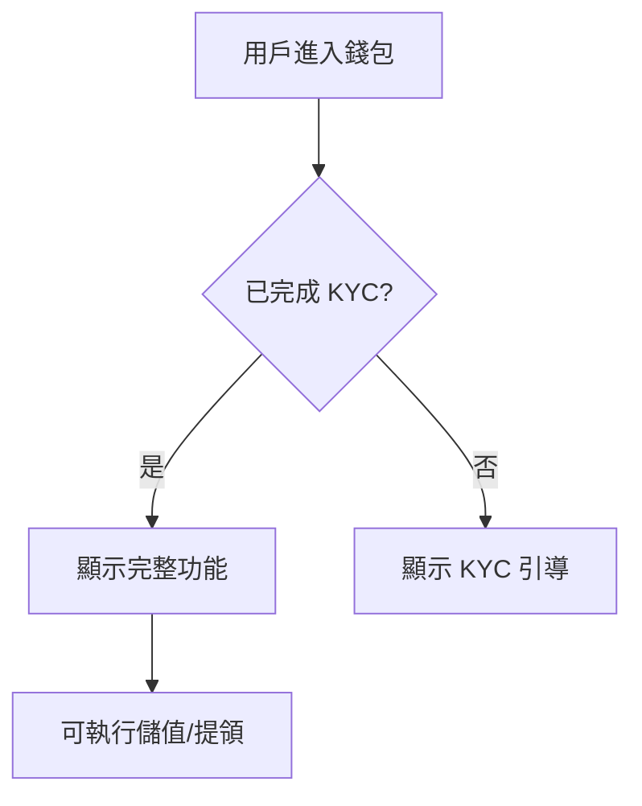
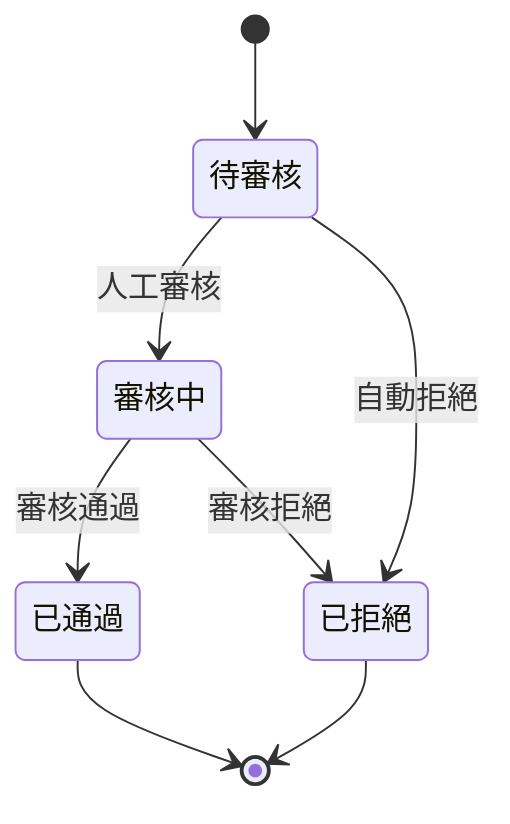

# 撰寫規格文件 - PM 視角指南

這是一套完整的規格文件撰寫指南，基於 **PM 視角**、**商業導向** 與 **架構優先** 的高品質標準。

## 概述

本 skill 幫助您撰寫專業級的規格文件，確保所有產出都能符合：
- ✅ **新進 PM 可理解**：不預設背景知識，淺顯易懂
- ✅ **商業語言優先**：描述「做什麼」與「為什麼」，避免技術術語
- ✅ **架構優先**：先整體後細節，讓讀者建立 Mental Model
- ✅ **視覺化輔助**：善用 Mermaid 圖表呈現邏輯
- ✅ **繁體中文**：所有內容使用繁體中文撰寫

## 適用情境

- 🎯 **產品需求規格 (PRD)**：新功能開發、產品迭代
  
- 🎯 **業務流程規格**：用戶操作流程、系統互動
  
- 🎯 **業務規則規格**：交易驗證、手續費計算、額度檢查

- 🎯 **狀態流轉規格**：訂單狀態、支付狀態、審核流程

- 🎯 **報表資料規格**：對帳單、業績報表、數據查詢

## 核心原則

### 1. 溝通協定

#### 語言限制
- **繁體中文優先**：所有內容使用繁體中文
- **專業術語**：首次出現時加上連結指向術語定義
- **範例明確**：提供具體的業務情境範例

#### 提交訊息
- 工具描述欄位使用繁體中文
- 清楚說明變更內容

### 2. 思維模式

#### 新進 PM 視角
- **目標讀者**：假設讀者剛加入專案，對背景一無所知
- **內容深度**：淺顯易懂，不預設專業知識
- **解釋充分**：重要概念都需要說明

#### 商業需求導向
- **What & Why**：描述「做什麼」與「為什麼」
- **避免技術細節**：
  - ❌ 錯誤：「當 user.kyc_status === 'verified' 時...」
  - ✅ 正確：「當用戶完成 KYC 驗證後...」
- **業務邏輯優先**：關注商業規則而非實作方式

#### 模擬真實用戶
- **測試思維**：想像真實用戶的操作行為
- **關注點**：介面互動、流程順暢度、防呆機制
- **邊界案例**：考慮各種異常情況

#### 商業規則合規
- **驗收標準**：涵蓋關鍵商業邏輯
- **範例規則**：KYC、交易限額、費率計算
- **業務規範**：確保系統符合業務要求

### 3. 產出標準

#### 文件結構

標準格式：

```markdown
# [功能名稱]

[1-2 句簡要說明功能目的]

## 目錄
- [1. 概述 / 範疇](#1-概述--範疇)
- [2. 架構圖 / 流程圖](#2-架構圖--流程圖)
- ...

## 1. 概述 / 範疇

### 1.1 功能目標
...

### 1.2 目標用戶
...

### 1.3 範疇界定
...

## 2. 架構圖 / 流程圖
[Mermaid 圖表]

## 3. 詳細規格
...
```

#### 閱讀順序原則

**架構優先 (Architecture First)**：
1. **先整體**：交代完整架構、流程圖、核心概念
2. **後細節**：逐步展開詳細規則與邊界案例
3. **建立 Mental Model**：讓讀者先理解全貌

**由上至下 (Top-Down)**：
- 假設讀者從頭讀到尾
- 每個章節都能獨立理解
- 避免前後文依賴

⚠️ **嚴格檢查**：
若細節出現在架構之前，導致讀者第一時間看不懂，即使內容正確也視為**不合格**。

#### 標題原則

**情境化與具體化**：
- ❌ 錯誤：「功能說明」、「系統流程」
- ✅ 正確：「會員錢包的儲值與提領流程」

**反映業務內容**：
- 使用商業語言
- 具體描述功能
- 避免技術術語

#### 視覺化輔助

**善用 Mermaid 圖表**：



**圖表類型選擇**：
- **流程圖 (flowchart)**：用戶操作流程
- **狀態圖 (stateDiagram)**：狀態轉換
- **時序圖 (sequenceDiagram)**：系統互動
- **類圖 (classDiagram)**：資料結構（少用）

#### 術語一致性

**規範**：
1. 專有名詞與 `index.md` 定義一致
2. 首次出現時加上超連結
3. 全文使用一致的術語

**範例**：
```markdown
當用戶完成 [KYC](./index.md#kyc) 驗證後...
```

---

## 規格架構模式

根據功能特性選擇合適的架構模式：

### 1. 流程/功能型規格 (Flow/Feature Specs)

**適用情境**：
- 用戶操作流程
- 購物車功能
- 任務中心
- 複合功能模組

**重點要素**：
- 順序 (Sequence)
- 互動 (Interaction)
- 整合 (Integration)

**標準架構**：

```markdown
# [功能名稱]

## 1. 概述 / 範疇
- 功能目標
- 目標用戶
- 範疇界定

## 2. 整體流程圖
[Mermaid flowchart]

## 3. 核心邏輯
### 3.1 狀態定義
### 3.2 業務規則

## 4. 步驟詳解
### 4.1 步驟 1：[步驟名稱]
- UI 元素
- 用戶行為
- 系統回應

### 4.2 步驟 2：...

## 5. 例外流程
### 5.1 錯誤處理
### 5.2 邊界案例

## 6. 驗收標準
```

**範例**：會員錢包、購物車結帳

---

### 2. 規則/邏輯型規格 (Rule-Based Specs)

**適用情境**：
- 交易驗證
- 手續費計算
- 額度檢查
- 資格判定

**重點要素**：
- 條件 (Condition)
- 結果 (Result)
- 優先級

**標準架構**：

```markdown
# [規則名稱]

## 1. 概述
- 規則目的
- 適用範圍

## 2. 驗證模型
[層級結構圖]

## 3. 驗證時機
- 何時觸發
- 執行順序

## 4. 規則總表

| 條件 | 結果 | 錯誤訊息 | 優先級 |
|------|------|---------|--------|
| 若 A | 則 B | "..." | P1 |
| ...  | ...  | ...   | ... |

## 5. 規則詳解
### 5.1 規則 1：[規則名稱]
- 判斷條件
- 執行結果
- 範例情境

## 6. 邊界案例
- 極值測試
- 組合條件
- 例外處理

## 7. 驗收標準
```

**規則表格範例**：

| 情境 | 條件 | 系統行為 | 錯誤訊息 |
|------|------|---------|---------|
| 儲值金額過低 | 金額 < 100 元 | 拒絕交易 | "最低儲值金額為 100 元" |
| 單日超過限額 | 當日累計 > 50,000 | 拒絕交易 | "您已達到單日儲值上限" |
| KYC 未完成 | KYC 狀態 = 未驗證 | 導向 KYC | "請先完成身份驗證" |

**範例**：交易限額規則、手續費計算

---

### 3. 狀態型規格 (State-Based Specs)

**適用情境**：
- 訂單狀態流轉
- 支付狀態
- 審核流程
- 帳戶狀態

**重點要素**：
- 狀態 (State)
- 轉換 (Transition)
- 觸發條件

**標準架構**：

```markdown
# [狀態流程名稱]

## 1. 概述
- 狀態機目的
- 管理對象

## 2. 狀態機圖



## 3. 狀態定義

| 狀態代碼 | 狀態名稱 | 說明 | UI 顯示 |
|---------|---------|------|---------|
| PENDING | 待審核 | ... | "審核中" |
| ...     | ...    | ... | ... |

## 4. 轉換邏輯

### 4.1 待審核 → 審核中
- 觸發條件：...
- 執行動作：...
- 通知機制：...

## 5. 狀態查詢規則

## 6. 驗收標準
```

**範例**：訂單狀態、KYC 審核流程

---

### 4. 報表/資料型規格 (Report-Based Specs)

**適用情境**：
- 對帳單
- 業績報表
- 後台查詢清單
- 數據匯出

**重點要素**：
- 資料來源 (Source)
- 篩選條件 (Filter)
- 欄位定義 (Columns)

**標準架構**：

```markdown
# [報表名稱]

## 1. 概述
- 報表目的
- 使用對象
- 更新頻率

## 2. 篩選條件

| 篩選項 | 類型 | 必填 | 預設值 | 說明 |
|--------|------|------|--------|------|
| 日期區間 | Date Range | 是 | 本月 | ... |
| ...     | ...       | ... | ...  | ... |

## 3. 報表欄位定義

| 欄位名稱 | 資料來源 | 格式 | 計算邏輯 | 範例 |
|---------|---------|------|---------|------|
| 交易日期 | orders.created_at | YYYY-MM-DD | - | 2026-01-18 |
| ...     | ...              | ...        | ... | ... |

## 4. 排序規則

## 5. 分頁規則

## 6. 統計/匯出規則
- 小計
- 總計
- 匯出格式（CSV/Excel）

## 7. 驗收標準
```

**範例**：月對帳單、銷售報表

---

## 使用方式

### 步驟 1：確定規格類型

根據功能特性選擇架構模式：

| 功能特徵 | 推薦模式 |
|---------|---------|
| 用戶需要按步驟操作 | 流程/功能型 |
| 需要判斷多個條件 | 規則/邏輯型 |
| 有明確的狀態轉換 | 狀態型 |
| 展示/匯出數據 | 報表/資料型 |

### 步驟 2：套用架構模板

1. 複製對應的架構模板
2. 填寫各章節內容
3. 確保架構優先、細節在後

### 步驟 3：撰寫內容

**架構層（優先）**：
1. 簡要說明（1-2句）
2. 目錄
3. 概述 / 範疇
4. 整體流程圖 / 架構圖

**細節層**：
5. 核心邏輯 / 規則
6. 步驟詳解 / 狀態定義
7. 例外處理
8. 驗收標準

### 步驟 4：檢查清單

**結構檢查**：
- [ ] 有簡要說明與目錄
- [ ] 架構圖出現在細節之前
- [ ] 標題具體情境化
- [ ] 使用 Mermaid 圖表

**內容檢查**：
- [ ] 使用繁體中文
- [ ] 使用商業語言（避免技術術語）
- [ ] 新進 PM 可理解
- [ ] 專有名詞有連結

**品質檢查**：
- [ ] 從頭讀到尾邏輯通順
- [ ] 無前後文依賴
- [ ] 範例具體明確
- [ ] 驗收標準可測試

---

## 範例

### 範例 1：流程型規格（會員錢包）

完整範例請參考：
- [會員錢包功能 PRD](./examples/wallet-feature-prd.md)

**關鍵特色**：
- 清楚的狀態定義表格
- 完整的流程圖（儲值/提領）
- 規則表格（金額限制、時效）
- 商業語言描述

### 範例 2：規則型規格（交易限額）

```markdown
# 交易限額驗證規則

## 1. 概述

### 1.1 規則目的
依據用戶的 KYC 等級與帳戶狀態，限制單筆/單日/單月交易金額，確保合規與風控。

### 1.2 適用範圍
- 儲值交易
- 提領交易
- 轉帳交易

## 2. 驗證時機

在用戶提交交易請求時，依序驗證：
1. KYC 等級
2. 帳戶狀態
3. 交易額度

## 3. 規則總表

| KYC 等級 | 帳戶狀態 | 單筆上限 | 單日上限 | 單月上限 |
|---------|---------|---------|---------|---------|
| 未驗證 | 正常 | 0 | 0 | 0 |
| 基礎 | 正常 | 50,000 | 100,000 | 500,000 |
| 進階 | 正常 | 無限制 | 無限制 | 無限制 |
| 任何 | 凍結 | 0 | 0 | 0 |

## 4. 驗收標準

- [ ] 未完成 KYC 的用戶無法儲值
- [ ] 基礎 KYC 用戶單筆不超過 50,000
- [ ] 帳戶凍結時所有交易被拒絕
- [ ] 超限時顯示明確錯誤訊息
```

---

## 注意事項

- ⚠️ **架構永遠優先**：細節出現在架構之前視為不合格
  
- ⚠️ **避免技術術語**：
  - 不寫 API 欄位名、資料庫 Schema、程式邏輯
  - 使用商業語言描述業務邏輯
  
- 💡 **善用視覺化**：
  - 流程用 flowchart
  - 狀態用 stateDiagram
  - 互動用 sequenceDiagram
  
- 💡 **讀者導向**：
  - 假設讀者是新進 PM
  - 不預設背景知識
  - 內容淺顯易懂

- 💡 **情境化**：
  - 標題具體反映業務
  - 範例使用真實情境
  - 避免制式化表達

---

## 進階技巧

### 技巧 1：使用 GitHub Alerts

```markdown
> [!WARNING]
> 此功能會影響現有的交易流程，需要與財務部門確認

> [!IMPORTANT]
> 此功能必須在 Q2 完成，配合行銷活動上線
```

### 技巧 2：建立中央術語表

在專案的 `index.md` 中定義所有專有名詞：

```markdown
## 術語定義

### KYC
Know Your Customer，客戶身份驗證流程...

### 約定帳戶
用戶綁定的銀行帳戶...
```

### 技巧 3：使用表格整理複雜規則

清楚列出條件與結果：

```markdown
| 情境 | 條件 | 系統行為 | 錯誤訊息 |
|------|------|---------|---------|
| ... | ... | ... | ... |
```

---

## 常見問題

**Q1: 何時使用哪種架構模式？**  
A: 
- 有明確操作步驟 → 流程型
- 複雜判斷邏輯 → 規則型
- 狀態會轉換 → 狀態型
- 展示數據 → 報表型

**Q2: 如何判斷是否符合「架構優先」？**  
A: 問自己：讀者看完前 3 章，是否能理解整體邏輯？如果不能，就需要調整。

**Q3: 技術細節應該寫到什麼程度？**  
A: PRD 專注 What & Why，技術實作 How 由工程師決定。但可在「非功能性需求」提出效能、安全等要求。

---

## 相關 Skills

- [撰寫產品需求文件 (PRD)](../documentation/write-prd/SKILL.md) - PRD 專門指南
- [Doc Coauthoring](../documentation/doc-coauthoring/SKILL.md) - 協作文件撰寫

---

**版本歷史**：
- v1.0.0 (2026-01-18)：初始版本，基於專案規則建立

**維護者**：Custom  
**最後更新**：2026-01-18
