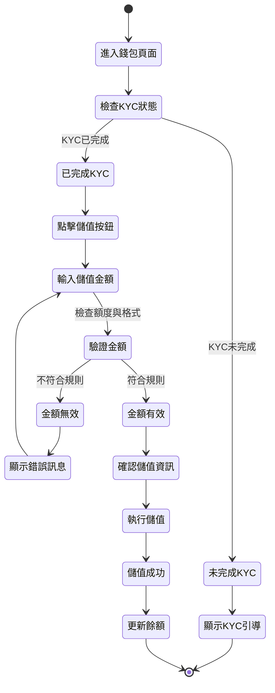
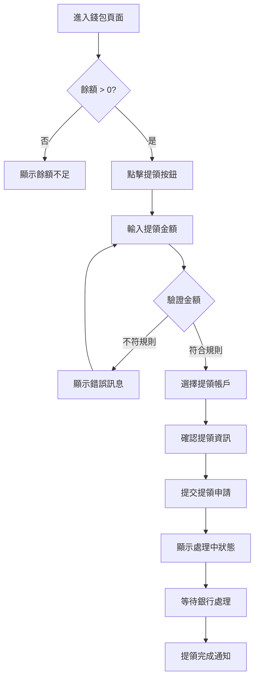

# 範例：金融平台會員錢包 PRD

## 情境說明

您正在為一個金融科技平台設計「會員錢包」功能，需要撰寫完整的 PRD 讓開發團隊理解需求。

## 功能背景

- **目標**：讓用戶可以在平台上儲值、提領、查看餘額
- **商業價值**：提升用戶留存率、增加平台交易量
- **限制**：僅限已完成 KYC 的用戶使用

## PRD 文件範本

以下是使用本 skill 產出的 PRD 範例：

---

# 會員錢包功能

為已完成 KYC 的會員提供便捷的儲值與提領服務，提升平台資金流轉效率。

## 目錄

1. [概述 / 範疇](#1-概述--範疇)
2. [商業目標與成功指標](#2-商業目標與成功指標)
3. [用戶情境與旅程](#3-用戶情境與旅程)
4. [功能規格](#4-功能規格)
5. [驗收標準](#5-驗收標準)
6. [非功能性需求](#6-非功能性需求)

---

## 1. 概述 / 範疇

### 1.1 功能目標

讓已完成 KYC 的會員可以：
- 透過約定帳戶儲值到平台錢包
- 從平台錢包提領款項至約定帳戶
- 即時查看錢包餘額與交易明細

### 1.2 目標用戶

- **主要用戶**：已完成 KYC 的一般會員
- **次要用戶**：尚未完成 KYC 的會員（僅可查看引導訊息）

### 1.3 範疇界定

✅ **範疇內**：
- 台幣儲值與提領
- 餘額查詢
- 交易明細查詢
- 約定帳戶管理

❌ **範疇外**：
- 外幣儲值（Phase 2）
- 跨境匯款
- P2P 轉帳
- 投資理財功能

---

## 2. 商業目標與成功指標

### 2.1 商業價值

1. **提升用戶留存**：讓用戶資金留在平台，增加黏著度
2. **增加交易量**：降低資金進出摩擦，促進交易
3. **降低成本**：減少即時入金的銀行手續費

### 2.2 成功指標

| 指標 | 目標值 | 衡量方式 |
|------|--------|----------|
| 月活躍錢包用戶數 | > 10,000 | 當月至少執行 1 次儲值/提領的用戶數 |
| 儲值成功率 | > 95% | 成功儲值次數 / 發起儲值次數 |
| 平均儲值金額 | > NT$ 5,000 | 總儲值金額 / 儲值次數 |
| 提領時效達成率 | > 90% | 在承諾時間內完成的提領比例 |

---

## 3. 用戶情境與旅程

### 3.1 儲值流程

### 3.2 提領流程

---

## 4. 功能規格

### 4.1 錢包狀態定義

| 狀態代碼 | 狀態名稱 | 觸發條件 | 可執行操作 | UI 顯示 |
|---------|---------|---------|-----------|---------|
| NORMAL | 正常 | 已完成 KYC 且無異常 | 儲值、提領、查詢 | 完整功能按鈕 |
| RESTRICTED | 受限 | 未完成 KYC | 僅可查詢 | 顯示 KYC 引導 |
| FROZEN | 凍結 | 人工審核或違規 | 僅可查詢 | 顯示凍結原因 |
| SUSPENDED | 暫停 | 系統維護期間 | 僅可查詢 | 顯示維護公告 |

### 4.2 儲值規則

#### 4.2.1 金額限制

| 限制類型 | 限額 | 錯誤訊息 |
|---------|------|---------|
| 單筆最低 | NT$ 100 | "單筆儲值金額不得低於 100 元" |
| 單筆最高 | NT$ 50,000 | "單筆儲值金額不得超過 50,000 元" |
| 單日累計 | NT$ 100,000 | "您已達到單日儲值上限 100,000 元" |
| 單月累計 | NT$ 500,000 | "您已達到單月儲值上限 500,000 元" |

#### 4.2.2 儲值來源

僅限從**已驗證的約定帳戶**儲值：
- 帳戶戶名需與會員姓名相符
- 須完成首次小額驗證

#### 4.2.3 入帳時效

| 儲值方式 | 預計入帳時間 | 說明 |
|---------|-------------|------|
| ATM 轉帳 | 30 分鐘內 | 銀行作業時間可能延遲 |
| 網銀轉帳 | 即時 | 通常 1-5 分鐘 |
| 虛擬帳號 | 30 分鐘內 | 需待銀行通知 |

### 4.3 提領規則

#### 4.3.1 金額限制

| 限制類型 | 限額 | 錯誤訊息 |
|---------|------|---------|
| 單筆最低 | NT$ 100 | "單筆提領金額不得低於 100 元" |
| 單筆最高 | NT$ 50,000 | "單筆提領金額不得超過 50,000 元" |
| 可提領餘額 | 錢包餘額 - 凍結金額 | "可提領金額不足" |
| 單日累計 | NT$ 100,000 | "您已達到單日提領上限 100,000 元" |

#### 4.3.2 提領目的地

僅限提領至**已驗證的約定帳戶**。

#### 4.3.3 處理時效

| 申請時間 | 預計到帳時間 | 說明 |
|---------|-------------|------|
| 平日 09:00-15:00 | 當日 17:00 前 | 銀行營業時間 |
| 平日 15:00 後 | 次營業日 17:00 前 | 隔日處理 |
| 假日 | 次營業日 17:00 前 | 順延至營業日 |

### 4.4 UI 規格

#### 4.4.1 錢包頁面佈局

主要顯示區域：
1. **餘額卡片**
   - 可用餘額（大字體）
   - 凍結金額（小字體）
   - 最後更新時間
   
2. **操作按鈕**
   - [儲值] 按鈕（主要 CTA）
   - [提領] 按鈕（次要 CTA）
   
3. **交易明細**
   - 近 10 筆交易記錄
   - [查看全部] 連結

#### 4.4.2 儲值流程 UI

**步驟 1：輸入金額**
- 快速選擇金額：1,000 / 3,000 / 5,000 / 10,000
- 自訂金額輸入框
- 顯示當日剩餘額度

**步驟 2：確認資訊**
- 儲值金額
- 來源帳戶（後四碼）
- 預計入帳時間
- [確認儲值] 按鈕

**步驟 3：完成頁面**
- 成功圖示
- "儲值申請已提交"
- 預計入帳時間提醒
- [返回錢包] 按鈕

---

## 5. 驗收標準

### 5.1 功能完整性

- [ ] 已完成 KYC 的用戶可以進入錢包頁面並看到完整功能
- [ ] 未完成 KYC 的用戶看到引導訊息與 KYC 入口
- [ ] 儲值金額正確反映在可用餘額中
- [ ] 提領後餘額正確扣減
- [ ] 交易明細正確記錄所有儲值與提領

### 5.2 商業規則正確性

- [ ] 儲值金額低於 100 元時無法提交
- [ ] 儲值金額超過單日/單月限額時顯示錯誤
- [ ] 提領金額超過可用餘額時無法提交
- [ ] 僅能從已驗證的約定帳戶儲值/提領
- [ ] 凍結狀態的錢包無法執行儲值/提領

### 5.3 用戶體驗

- [ ] 頁面載入時間 < 2 秒
- [ ] 儲值/提領流程可在 3 步內完成
- [ ] 錯誤訊息清楚易懂
- [ ] 成功/失敗有明確的視覺回饋

---

## 6. 非功能性需求

### 6.1 效能要求

- 頁面載入時間：< 2 秒（95th percentile）
- API 回應時間：< 500ms
- 支援同時 1,000 個併發用戶

### 6.2 安全要求

- 所有金額相關 API 需要 HTTPS
- 敏感資訊（帳號）需遮罩顯示
- 每次操作需驗證 JWT token
- 提領操作需二次確認

### 6.3 相容性

- 支援瀏覽器：Chrome、Safari、Edge（最新兩版）
- 支援裝置：桌面、平板、手機（響應式設計）

---

**文件版本**：v1.0  
**撰寫日期**：2026-01-18  
**負責 PM**：[您的名字]

